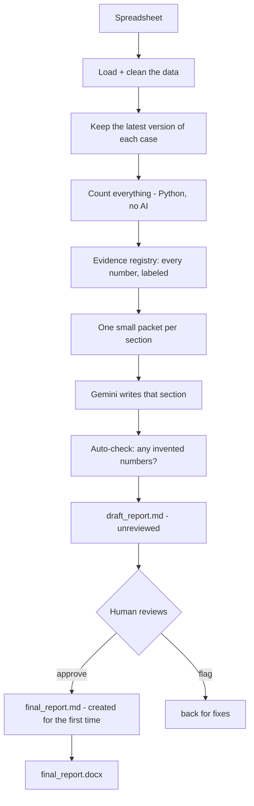

# PADER AI Engine

This is a system I built for the GenAR challenge. You give it a raw safety
spreadsheet (adverse event reports for a drug called Bisoprolol), and it
gives you back a structured PADER safety report as a Word doc — with a
human checking it before it counts as done.

The whole thing is built around one idea: **Python does the counting, AI
only does the writing.** The AI never touches the raw spreadsheet and never
does any math. It only ever sees numbers Python already worked out, and its
one job is turning those numbers into readable sentences.

---

## 1. How do I run it?

**Setup, once:**

```powershell
python -m venv .venv
.venv\Scripts\activate
pip install -r requirements.txt
```

Then make a `.env` file with your Gemini key:

```env
GEMINI_API_KEY=your_key_here
GEMINI_MODEL=gemini-2.5-flash
```

**And run these six commands, in this order:**

```powershell
python scripts/run_pipeline.py                                    # 1. load + count everything (no AI)
python scripts/generate_report.py                                 # 2. AI writes each section (only AI step)
python scripts/validate_report.py                                 # 3. check nothing got invented
python scripts/review_report.py status                            # 4. see what's waiting on you
python scripts/review_report.py approve --reviewer "Your Name"    # 5. you approve it
python scripts/generate_docx.py                                   # 6. makes the Word doc — only works after step 5
```

If you just want to check where things stand without running anything:

```powershell
python scripts/review_report.py status
```

---

## 2. What's the architecture?



Here's what actually happens, step by step, with where in the code each
thing lives:

1. **Load the spreadsheet and clean it up.**
   `src/ingestion/loader.py` loads it, `src/preprocessing/validator.py`
   checks the schema is what we expect.
2. **Some cases show up more than once** (different versions of the same
   report). We keep only the newest version of each one.
   `src/preprocessing/canonicalizer.py`
3. **Parse out the reactions and outcomes**, which come comma-separated in
   a single cell and need splitting apart carefully.
   `src/preprocessing/reaction_parser.py`
4. **Count everything** — total cases, serious vs. not, age groups,
   countries, top reactions, outcomes, monthly trends. All plain Python,
   no AI anywhere in here.
   `src/analysis/case_analysis.py`, `src/analysis/demographics.py`,
   `src/analysis/reactions.py`, `src/analysis/trends.py`
5. **Every number gets logged with an ID**, so it's traceable later —
   basically a lookup table of facts.
   `src/evidence/registry.py`
6. **For each of the 8 sections, build a small packet** with only the
   numbers that section actually needs.
   `src/context/builder.py`
7. **Gemini turns that packet into a paragraph.** That's its only job.
   `src/llm/generator.py`, using the actual wording in
   `src/llm/prompts.py`
8. **Right after generation, we check it** — did it use a number that
   wasn't in the packet? If so, flag it.
   (this check lives inside `src/llm/generator.py` too, and gets run
   again on the whole assembled report by `src/report/report_validator.py`)
9. **All 8 sections get combined into `draft_report.md`** — called
   "draft" on purpose, because nobody's looked at it yet.
   `src/report/report_generator.py`
10. **You read it and approve or flag it.**
    `scripts/review_report.py`
11. **Only at approval does `final_report.md` get created** — nothing
    named "final" exists before that moment.
12. **The Word doc gets built from that approved file.**
    `src/report/docx_generator.py`, run via `scripts/generate_docx.py`

---

## 3. Where's AI used vs. deterministic code, and why?

**Every single thing involving a number is plain Python (pandas).** That's
loading the data, deduplicating cases, and every count you see in the
report — case totals, serious breakdown, demographics, reactions,
outcomes, trends. All of it lives under `src/analysis/` and
`src/preprocessing/`, and none of it touches an AI model.

**AI (Gemini) does exactly one thing: turns already-correct numbers into
sentences.** It's told directly, in the prompt, not to calculate anything,
not to guess, not to add numbers together itself, not to draw conclusions
the data doesn't back up.

**Why split it like this?** Because an LLM doing math is basically a
confident-sounding guess. It might get "1,024 cases" right nine times in a
row and then quietly get it wrong the tenth time, and you'd have no way to
catch that just by reading the sentence. Python doing the same math is
exact every time, the same way you'd trust a spreadsheet formula over
someone eyeballing a column and guessing the sum. So I only ever ask the AI
to do the thing it's actually good at — writing — and never the thing it's
shaky at, which is counting.

---

## 4. What are the actual prompts?

Every section generation call sends two things: a system prompt (same
every time) and a user prompt (built fresh per section). Both live in
`src/llm/prompts.py` (357 lines total) and get assembled together in
`src/llm/generator.py`'s `build_user_prompt` function.

I'm not pasting all 8 section prompts here — that'd make this README
mostly unreadable. Instead here's the system prompt in full (the one that
matters most, since it applies to every call), one short section example,
and one longer one so you can see how it scales up. If you want to check
the rest, `src/llm/prompts.py` has all 8, clearly labeled with comment
headers like `# REACTION ANALYSIS`, one after another.

**System prompt — sent on every single call, in full** (`src/llm/prompts.py`, lines 5–59):

```
You are a regulatory pharmacovigilance report-writing assistant.

Your task is to write report sections using ONLY the APPROVED EVIDENCE
provided in the user prompt.

STRICT GROUNDING RULES

1. Use only facts, numbers, dates, counts, categories, and observations
   explicitly present in the approved evidence.
2. Do not invent facts, values, dates, percentages, reactions, countries,
   patient characteristics, regulatory actions, or conclusions.
3. Do not perform new calculations. Use supplied calculated values exactly
   as provided.
4. Do not infer causality. Never state or imply that the medicinal
   product caused a reaction.
5. Do not infer risk factors, associations, clinical significance,
   trends, or safety signals unless explicitly supported by the
   approved evidence.
6. Seriousness categories are independent and may overlap. Do not add
   them together to derive a total.
7. Reaction counts refer to reaction records unless the evidence
   explicitly identifies them as unique case counts.
8. If demographic information is present, describe it using only the
   supplied counts.
9. Do NOT say demographic information is unavailable when it's actually
   present.
10. Demographic information may be described descriptively only.
11. If a section has no approved evidence, explicitly state that the
    information was not available in the supplied evidence.
12. Do not fill missing information using general medical knowledge.
13. Use neutral regulatory/pharmacovigilance language.
14. Every numerical statement must be directly supported by the
    approved evidence.
15. Return only the requested report section.
```

**Shortest section prompt, in full** — Reporting Period
(`src/llm/prompts.py`, lines 66–73):

```
Describe the reporting period represented by the supplied evidence.

Prefer the exact start_date and end_date when they are present.
If exact dates are unavailable, use the supplied start/end months.
Do not invent an NDA/application identifier.
Do not calculate additional statistics.
```

**A meatier one, to show the pattern at real size** — Reaction Analysis
(`src/llm/prompts.py`, lines 252–271):

```
Prepare the Reaction Analysis section.

Report the supplied MedDRA Preferred Terms at the PT level.

Use the supplied reaction counts exactly.

Clearly state that the counts represent reaction records unless
the evidence explicitly states otherwise.

Do not:
- invent System Organ Class groupings
- infer causality
- state that reactions were caused by the product
- convert reaction counts into unique case counts
- recompute the supplied counts

Where outcome distributions are provided, clearly state that they
refer to reaction records.
```

**How it all gets stitched together** — this is what actually gets sent
to Gemini, from `build_user_prompt()` in `src/llm/generator.py`:

```
SECTION INSTRUCTIONS
{whichever section prompt from above applies}

APPROVED EVIDENCE
{only this section's numbers, as JSON — nothing else}

GROUNDING REQUIREMENTS
{the same "don't invent, don't calculate, don't infer causality" rules,
 repeated here so there's no way to miss them}

TASK
Write the requested report section. Return only the section text.
```

The thing to notice: the evidence block is small and specific to that one
section. Reaction Analysis only ever sees reaction and outcome counts —
never age, sex, or country — because it doesn't need them, and handing it
more just gives it more chances to wander off-topic.

---

## 5. How does the system stay grounded?

"Grounded" means every sentence traces back to a real number Python
calculated — nothing made up. Three things working together make this
happen:

1. **Small evidence packets.** Each AI call only gets the handful of
   numbers relevant to that one section. Less sitting in front of it
   means less room to invent from.
2. **The system prompt says the rules outright** — only use given
   numbers, don't do math, don't guess at causes, don't call something a
   "trend" or "signal" unless the data actually backs that word up.
   (`src/llm/prompts.py`)
3. **An automatic check runs right after generation.** It pulls out every
   number, date, and percentage the AI used and checks whether it's
   actually in the evidence packet. If something doesn't match, that
   section gets flagged instead of quietly passed through.
   (inside `src/llm/generator.py`, and checked again for the whole
   report by `src/report/report_validator.py`)

And beyond all three — a human still reads the report before it's
approved (`scripts/review_report.py`). The automatic check catches
invented numbers. A person catches things a checker can't, like a
sentence that's technically accurate but framed in a misleading way.

---

## 6. How would I evaluate this at scale (1,000 reports, not one)?

- **Run the grounding check on every report**, not just spot checks — it
  already runs on every section as part of the normal flow, so this is
  really just "don't skip it."
- **Track the flag rate as a health signal.** 2 flags out of 1,000 is
  healthy edge cases. 200 flags means something's actually wrong — maybe
  a prompt change, maybe the data format shifted — and that's worth
  digging into before more reports go out.
- **Only send flagged reports to a human**, not all 1,000. Same idea as
  the review gate already built in, just applied at volume.
- **Spot-check some reports that passed too**, not only the failures. A
  grounding checker only catches wrong numbers — it won't catch a
  sentence that's technically correct but misleadingly framed. A small
  random sample of "passing" reports getting human eyes keeps that blind
  spot in check.
- **Keep a small set of known-correct example reports** to periodically
  re-test against, so if a future prompt or model change quietly makes
  things worse, it gets caught early instead of slowly drifting
  unnoticed.

---

## 7. Known limitations

1. **Only one report type (PADER) is built.** Adding PSUR/DSUR/etc.
   means adding config, not rewriting the counting or generation code —
   see [`VERSION_1.md`](VERSION_1.md) for exactly what that'd look like.
2. **This isn't a replacement for a real reviewer.** It's a drafting
   tool with a human checkpoint built in, not something meant to run
   fully on its own.
3. **"Expectedness" isn't calculated** — no product label was given to
   compare against. If one were added, it'd be a new counting function
   under `src/analysis/`, not a prompt change.
4. **No history of past regulatory actions** — none was in the dataset,
   so the report says so directly instead of guessing.
   (`src/llm/prompts.py`, the `HISTORY_PROMPT`)
5. **No real signal-detection statistics.** Trends are stated as numbers
   ("21 cases in December, 109 in July") — not flagged as meaningful or
   not. That call is left to the human reviewer on purpose.
   (`src/analysis/trends.py`)
6. **Two grounding checks overlap.** One checks each section right after
   it's generated (`src/llm/generator.py`); a separate one re-checks the
   whole assembled report at the end (`src/report/report_validator.py`).
   I found this while going through the code — the right fix is merging
   them into one shared checker. Didn't do it yet, since I didn't want to
   risk breaking two things that both currently work, this close to the
   deadline.
7. **Tests are narrow but real, not broad and fake.** Two files —
   `tests/test_canonicalizer.py` and `tests/test_reactions.py` — cover
   the two spots most likely to silently produce wrong numbers on this
   exact dataset: deduplicating cases correctly, and splitting the
   comma-separated reaction fields correctly. Other modules don't have
   tests yet.

---

## Version 1

Not built yet — see [`VERSION_1.md`](VERSION_1.md) for what it would
actually involve, in plain terms, plus a diagram. Short version: it's
about moving "which numbers does each section need" out of Python code
and into a config file, so a new report type is a config entry instead of
new functions.

---

## A few facts about this dataset, for reference

- 1,068 rows in the raw file, 1,024 unique cases (some got reported more
  than once, as different versions)
- 1,023 of those 1,024 cases are serious
- 3,648 individual reaction records once the multi-reaction cells get
  split apart
- Reporting period: 2024-12-27 to 2025-12-26

(all of the above is computed live by `scripts/run_pipeline.py` and saved
to `outputs/analysis_results.json` — not hand-typed here)
