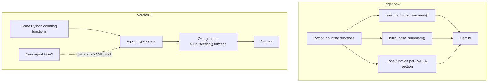

# Version 1 — where this would go next

The challenge lists 7 possible directions for Version 1 and says to "pick
whatever's interesting to you" — not to do all 7. So that's what I did:
I went deep on one direction (it's the one that unlocks the most value for
the least code), and I've got a short, honest answer for the other 6 —
some of which turn out to already be partly true of Version 0, without me
setting out to build them that way.

Here's the list from the brief, and where each one stands:

| Direction | Status |
|---|---|
| Section dependencies | **Main focus — see below** |
| Configurable instructions | **Main focus — see below** |
| Reusable analyses | **Already true in Version 0**, see below |
| Section regeneration | **Already partly true in Version 0**, see below |
| Evaluation | Sketched below (also touched on in the main README) |
| Versioning | Sketched below |
| Evidence tracing | Sketched below |
| Another report type / data source / previous-report comparison | Sketched below |

---

## The main focus: section dependencies + configurable instructions

### The problem

If my interviewer said "now support PSUR too" (a different safety report,
different sections), I'd be in trouble — not because the counting logic
can't handle it, but because the *wiring* is hardcoded to PADER.

Look at `src/context/builder.py` today: there's a function called
`build_narrative_summary()`, another called `build_case_summary()`, one
per PADER section, each hardcoded to know exactly which numbers that
section needs. Adding PSUR means writing a whole new set of these, even
though PSUR would reuse a lot of the same counts PADER already
calculates.

### The fix, in one sentence

**Move "which numbers does this section need, and what should the AI be
told" out of Python functions and into a config file, so a new report
type is a config entry, not new code.**

```yaml
# report_types.yaml — doesn't exist yet, this is the plan

PADER:
  sections:
    - name: narrative_summary
      needs: [case_summary, demographics, top_reactions]
      instructions: "Summarize case counts and top reactions. No causality claims."
    - name: trends
      needs: [monthly_trend]
      instructions: "Describe temporal counts only. No safety-signal language."
    # ...the other 6 PADER sections, same shape

PSUR:
  sections:
    - name: safety_overview
      needs: [case_summary, demographics]   # reuses the exact same functions PADER uses
      instructions: "..."
```

### How the architecture would change



### What this would actually take

1. **Write `report_types.yaml`** with the current 8 PADER sections
   expressed this way. Proves the pattern works, even before a second
   report type exists.
2. **Replace the per-section functions in `src/context/builder.py`** with
   one function like `build_section(section_name, report_type_config)`
   that reads the YAML and pulls whichever `needs` it lists.
3. **Move the section instructions out of `src/llm/prompts.py`** and into
   that same YAML, so instructions live next to the data requirements
   they go with.
4. **Prove it end to end** by adding one more section or a small second
   report type that reuses an existing counting function.

I didn't build this for Version 0 — real time constraint, and the brief
explicitly accepts a written plan as a substitute when time's short. I'd
rather this document be a straight, honest plan than a rushed, half-working
config system.

---

## Reusable analyses — this one's already true, wasn't even trying

The brief's example here is "the same 'serious case count' logic serving
multiple report types." Turns out `src/analysis/case_analysis.py`,
`demographics.py`, `reactions.py`, and `trends.py` already work this way —
they take a dataframe in and return numbers out, with zero idea what
report type or section is asking. That wasn't a deliberate Version 1
feature, it's just how I happened to write Version 0, but it means this
box is already checked. The section-dependencies work above is really
about wiring these functions up flexibly, not about rewriting them.

---

## Section regeneration — also already partly true

`src/report/report_generator.py` is resumable: if you delete one
section's file from `outputs/generated_report/sections/`, only that
section regenerates on the next run — everything else gets reused as-is.
That's most of what "section regeneration" means. What's missing is a
clean command for it (right now it's "manually delete the file"); a
`scripts/regenerate_section.py <section_name>` wrapper would be a small,
easy addition on top of what's already there.

---

## Evaluation — sketched

The main README already answers "how would I evaluate this at 1,000
reports" in detail (question 6), so I won't repeat it here. The short
version: run the grounding checker on every report automatically, track
the flag rate as a health metric, and keep a small set of known-correct
example reports to periodically re-test against so quality drift gets
caught early.

One thing worth adding for Version 1 specifically: a small "golden"
dataset — 5 or 10 hand-picked cases with manually verified correct
answers — that the analysis functions in `src/analysis/` get tested
against automatically, so a future code change that quietly breaks a
count gets caught before it ever reaches the LLM. `tests/test_canonicalizer.py`
and `tests/test_reactions.py` are the first two pieces of this; the rest
would follow the same pattern.

---

## Versioning — sketched

The idea: know exactly which dataset, which code, which prompt, and which
model produced any given report, so if something looks wrong later you
can trace it back.

Right now there's no version stamp anywhere. The fix is small: write a
`run_metadata.json` next to `analysis_results.json` with a hash of the
input spreadsheet, the git commit the code was run at, and the
`GEMINI_MODEL` value from `.env`, all captured at the moment
`run_pipeline.py` runs. Then `review_status.json` (which already records
who approved a report and when) would just add a reference to that
metadata file. Nothing about this needs new infrastructure — it's a
handful of fields written at the points where the pipeline already
touches disk.

---

## Evidence tracing — sketched

The idea from the brief: click a sentence in the report, see the exact
data behind it.

This one's closer than it looks, because the pieces already exist:
`src/evidence/registry.py` already assigns an ID to every fact (like
`E002` for `serious_cases`), and the grounding checker in
`src/llm/generator.py` already extracts every number out of generated
text and checks it against the evidence packet. What's missing is just a
rendering layer connecting the two: instead of only checking a match,
also record *which* evidence ID each number matched, and output that
mapping alongside the report. A simple HTML version of the final report
where each number is wrapped in a `<span>` with a tooltip showing its
evidence ID would get most of the way there, using extraction logic that
already exists rather than new work.

---

## Another report type, another data source, previous-report comparison — sketched

These are grouped together in the brief as "anything that stress-tests
reusability," so one example covers the spirit of all three:

**Previous-report comparison** is the most natural one to add here, since
it reuses everything already built. It would need: (1) saving each run's
`analysis_results.json` somewhere it won't get overwritten by the next
run, and (2) a new analysis function — say
`compare_to_previous(current_results, previous_results)` — that
diffs the two (case count change, new top reactions, trend shift) and
gets fed into a new report section the same way every other section
already works. Nothing here needs a new architecture; it's one more
analysis function and one more section entry in the config from the top
of this document.

---

## What stays exactly the same, no matter which of these get built

Worth being direct about this: `src/analysis/`, `src/preprocessing/`, and
`src/evidence/registry.py` wouldn't need to change for any of the above.
They already just take data in and return numbers out, with no awareness
of report type, section, or what's being evaluated. That's not an
accident — keeping those functions this plain from the start is what
makes every direction above a realistic next step instead of a rewrite.
